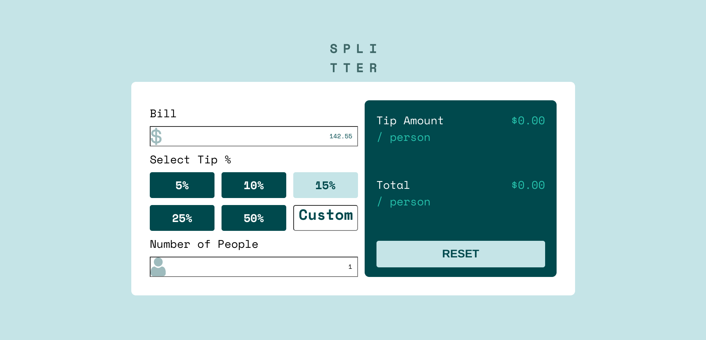

# Frontend Mentor - Tip calculator app solution

This is a solution to the [Tip calculator app challenge on Frontend Mentor](https://www.frontendmentor.io/challenges/tip-calculator-app-ugJNGbJUX). Frontend Mentor challenges help you improve your coding skills by building realistic projects.

## Table of contents

- [Overview](#overview)
  - [The challenge](#the-challenge)
  - [Screenshot](#screenshot)
  - [Links](#links)
- [My process](#my-process)
  - [Built with](#built-with)
  - [What I learned](#what-i-learned)
  - [Continued development](#continued-development)
  - [Useful resources](#useful-resources)

## Overview

### The challenge

Users should be able to:

- View the optimal layout for the app depending on their device's screen size
- See hover states for all interactive elements on the page
- Calculate the correct tip and total cost of the bill per person

### Screenshot

### Links

- Live Site URL: [Github Pages](https://jdegand.github.io/tip-calculator-app/)

## My process

### Built with

- Semantic HTML5 markup
- CSS custom properties
- Flexbox
- CSS Grid

### What I learned

My JavaScript really came together when I allowed myself a global variable.  The custom tip % box was a pain.  

### Continued development

This project does not lend itself well to semantic markup and accessibility.

### Useful resources

- [Stack Overflow - Image Height](https://stackoverflow.com/questions/40894381/image-height-inside-flexbox-not-working-in-chrome)

- [W3 Schools - Input type number](https://www.w3schools.com/howto/howto_css_hide_arrow_number.asp)

- [W3 Schools - Centering image](https://www.w3schools.com/howto/howto_css_image_center.asp)

- [Stack Overflow - Input width](https://stackoverflow.com/questions/17302794/how-to-set-an-input-width-to-match-the-placeholder-text-width)

- [AutoPrefixer](https://autoprefixer.github.io/)
